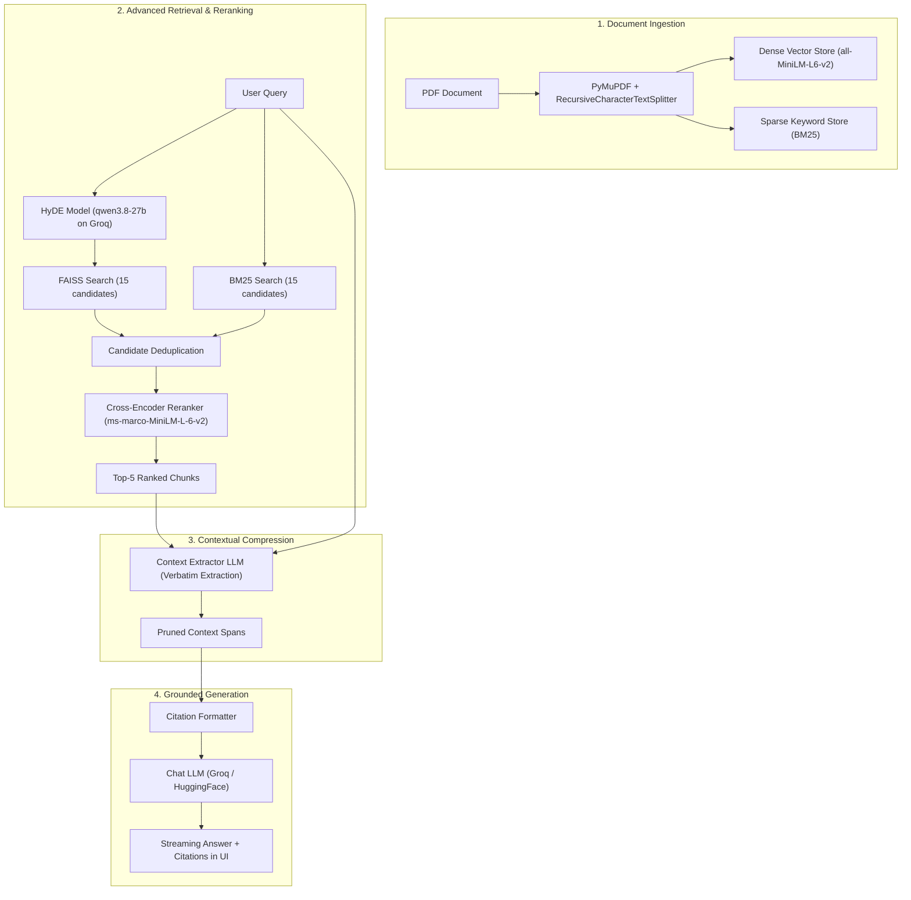

# 📄 DocuMind-RAG

> An enterprise-grade, LangChain-powered Document Intelligence system designed for accurate, citation-backed question answering over complex PDF documents.

Built with an **Advanced RAG Architecture**: **HyDE Query Expansion $\rightarrow$ Hybrid Search (Dense FAISS + Sparse BM25) $\rightarrow$ Cross-Encoder Reranking**, systematically benchmarked and evaluated using **DeepEval**.

---

## 🌟 Key Features

- **Multi-Stage Advanced Retrieval**:
  - **HyDE (Hypothetical Document Embeddings)**: Bridges vocabulary gaps between user queries and document passages using `qwen/qwen3.8-27b` via Groq.
  - **Hybrid Search**: Combines dense semantic retrieval (`sentence-transformers/all-MiniLM-L6-v2` in FAISS) and sparse lexical retrieval (`BM25`) with candidate oversampling ($3\times$).
  - **Cross-Encoder Reranker**: Scores query-document pairs using `cross-encoder/ms-marco-MiniLM-L-6-v2` to eliminate rank inversion and place the most relevant chunks at the top.
  - **Contextual Compression & Verbatim Extractor**: Uses an extractor LLM to prune irrelevant chunks and extract tightly-scoped verbatim spans from retrieved passages.
- **Conversational RAG Chain**: Query contextualization with chat history, grounded answer generation, and precise source citations (`[Source X | Page Y]`).
- **Interactive Streamlit Web Interface**: Real-time PDF upload, indexing metrics visualization, streaming chat responses, verbatim extraction toggle, and expandable source verification cards.
- **Systematic Evaluation Framework**: Automated retriever and generator evaluation using **DeepEval** and a remote, high-throughput `GroqJudge`.

---

## 📊 Benchmark & Evaluation Results

Evaluated against 10 golden test cases curated from standard legal/policy documentation:

### 1. Retriever Benchmarks
| Metric | Baseline (Naive Hybrid) | Advanced (HyDE + CrossEncoder) | Improvement |
| :--- | :---: | :---: | :---: |
| **Contextual Recall** | 0.92 avg (60% pass rate) | **1.00 avg (100.00% pass rate)** | **+40%** |
| **Contextual Precision** | 0.78 avg (30% pass rate) | **0.84 avg (100.00% pass rate)** | **+70%** |
| **Contextual Relevancy** | 0.42 avg (27% pass rate) | **0.40 avg (30.00% pass rate)** | Stable |

### 2. Generator Benchmarks
| Metric | Average Score | Pass Rate | Status |
| :--- | :---: | :---: | :---: |
| **Answer Relevancy** | **0.98** | **100.00%** (10/10 passed) | 🌟 Direct & Complete |
| **Faithfulness** | **0.91** | **90.00%** (9/10 passed) | 🌟 Highly Grounded |
| **Overall Pass Rate** | — | **90.00%** | Meets Production SLA |

---

## 🏗️ Architecture



---

## 📂 Project Structure

```text
Youtube_chatbot_using_rag/
├── data/
│   └── sample_policies.pdf         # Sample evaluation document
├── eval/
│   ├── eval_retriever.py           # DeepEval automated retriever evaluation
│   ├── eval_generator.py           # DeepEval automated generator evaluation
│   ├── benchmark_compression.py    # A/B evaluation benchmark for contextual compression
│   ├── graq_judge.py               # Custom remote GroqJudge & LLM judges
│   ├── generator_eval_results.json # DeepEval generator test results
│   └── compression_benchmark_results.json # A/B benchmark metrics
├── goldens/
│   ├── retriever_golden.json       # Golden dataset for retrieval
│   └── generator_golden.json       # Golden dataset with ideal chunks for generation
├── scripts/
│   ├── app.py                      # Full Streamlit web UI
│   ├── generation.py               # LLM creation factory
│   ├── rag_chain.py                # Conversational RAG chain logic
│   └── retriever.py                # HyDE + Hybrid + CrossEncoder pipeline
├── app.py                          # Application entry point
├── documentation.md                # Comprehensive technical documentation & engineering journal
├── requirements.txt                # Production dependencies
└── .env.example                    # Safe environment template
```

---

## 🚀 Quick Start

### 1. Clone & Setup Environment
```bash
git clone https://github.com/yogibaba7/DocuMind-RAG.git
cd DocuMind-RAG

python -m venv myenv
# On Windows:
.\myenv\Scripts\activate
# On Linux/macOS:
source myenv/bin/activate

pip install -r requirements.txt
```

### 2. Configure API Keys
Copy `.env.example` to `.env` and fill in your keys:
```bash
cp .env.example .env
```
Edit `.env`:
```ini
GROQ_API_KEY=gsk_...
HUGGINGFACE_API_KEY=hf_...
```

### 3. Launch the Web App
```bash
streamlit run app.py
```
Open `http://localhost:8501` in your browser.

### 4. Run Automated Evaluations
```powershell
# Set UTF-8 encoding (recommended on Windows):
$env:PYTHONIOENCODING='utf-8'; $env:PYTHONUTF8='1'

# Evaluate Retriever (Recall, Precision, Relevancy):
python -m eval.eval_retriever

# Evaluate Generator (Faithfulness, Answer Relevancy):
python -m eval.eval_generator
```

---

## 📖 Documentation & Engineering Journal

For in-depth architectural specifications, design rationales, troubleshooting, and problem-solution entries (`[PRB-001]` through `[PRB-006]`), refer to **[`documentation.md`](documentation.md)**.
